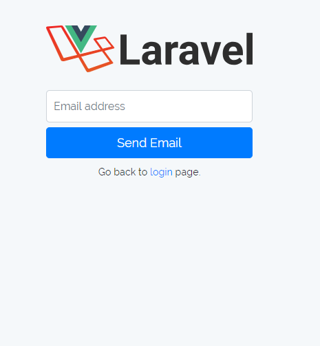
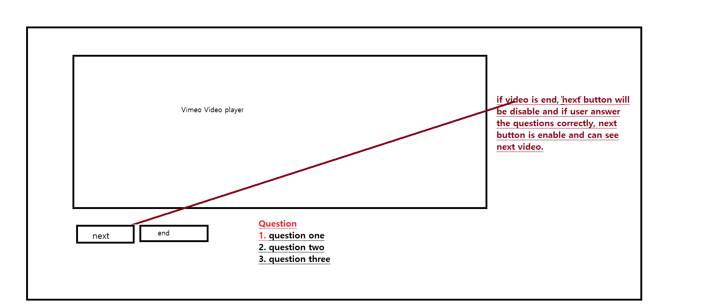
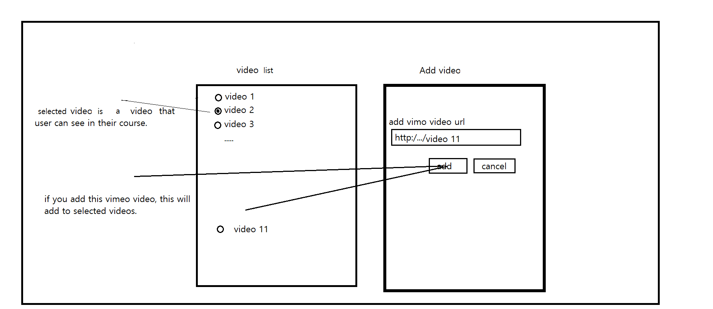
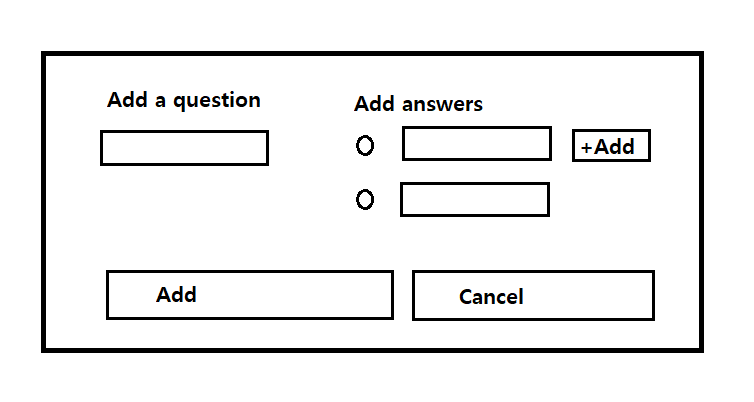
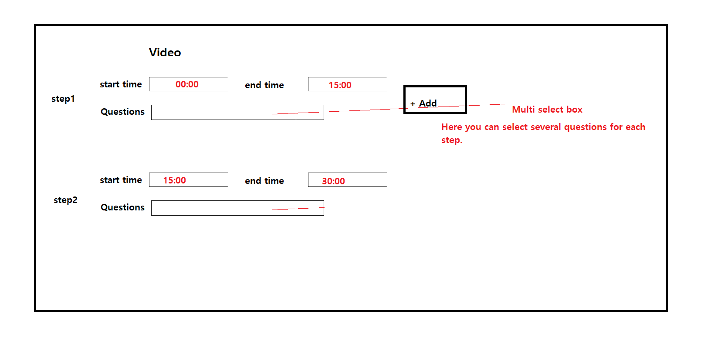

Laravel Auth Route that it works with vue and vueify
- expand the Register Tool that it works only with a one-time code
- Answer and Questions system
- the result should be stored in the database
- possible to add more or newer videos.

 
 
 

 
 
 

 
 
 

 
 
 

 
 
 

 
 
 